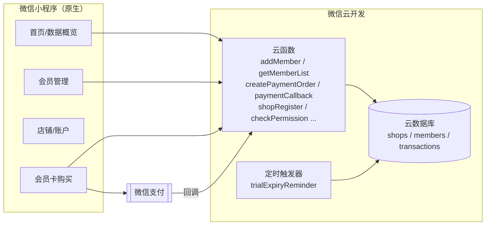

# 商户会员工作台 · Merchant Membership Mini-Program


> 给中小商户（奶茶店、美业、餐饮…）开箱即用的**会员管理微信小程序**：会员建档、储值会员卡、微信支付、数据统计、到期提醒。
> 后端基于**微信云开发**，零自建服务器，导入即可跑。
>
> An out-of-the-box WeChat **Mini-Program for small-merchant membership management**: member profiles, stored-value cards, WeChat Pay, stats, and expiry reminders. Backed by WeChat Cloud Development — no server to maintain.

---

## 适合谁 / Who it's for

个体商户、连锁小店、本地生活服务商，想用微信生态低成本管理会员和储值，又不想自建后端。

## 架构 / Architecture



## 功能 / Features

- 会员管理：建档、列表、搜索、生日提醒
- 会员卡套餐：月卡 / 季卡 / 年卡 / 永久卡 + 12 天试用
- 微信支付：下单与支付回调、交易历史
- 店铺注册与信息管理、权限校验
- 数据概览统计
- 试用到期提醒（定时云函数）
- 数据与账号永久绑定，登录后完整恢复（云数据库为准，本地仅缓存）

## 技术栈 / Stack

`微信小程序（原生 JS/WXML/WXSS）` · `微信云开发`（云函数 + 云数据库）· `wx-server-sdk` · `微信支付`

## 快速开始 / Getting Started

1. 用 **微信开发者工具** 导入本项目
2. 在 `project.config.json` 填入 **你自己的** AppID
3. 开通云开发环境，上传并部署 `cloudfunctions/` 下的各云函数
4. 微信支付的商户号 / 密钥请配置在 **云开发环境变量** 中，**不要硬编码进代码**
5. 初始化云数据库集合（`shops` / `members` / `transactions`，索引见 `DEVELOPMENT_LOG.md`）

## 目录结构 / Layout

```
miniprogram/        小程序前端（pages / images / app.*）
cloudfunctions/     云函数（会员、支付、统计、权限、定时提醒）
DEVELOPMENT_LOG.md  数据库 Schema 与索引设计
```

> `project.private.config.json` 与 `node_modules/` 已被 `.gitignore` 排除。

## License

[MIT](./LICENSE)
